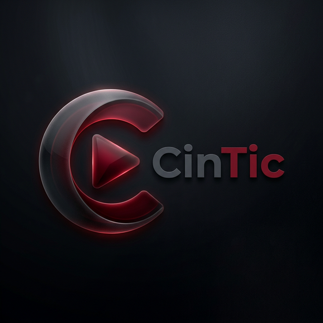

<div align="center">
  
  <h1>CinTic - The Future of Cinema Booking</h1>
  <p>A completely reimagined, ultra-premium movie ticketing experience enhanced with Artificial Intelligence.</p>
</div>

---

## 🌟 Overview  
CinTic is a modern, responsive, single-page application (SPA) created for the ultimate cinematic booking experience. Featuring a stunning glassmorphic dark-themed UI, it goes beyond traditional booking sites by offering smart seat recommendations, an AI-powered concierge, integrated snacks, and real-time backend synchronization.


---

## 🚀 Key Features

### 🤖 CinBot AI Concierge
- Integrated LLaMA-3.3-70b AI model (via Groq) acting as a personalized cinema assistant.
- Strictly domain-restricted: Instantly answers queries regarding your bookings, movies, and app navigation—and securely rejects off-topic prompts.
- Remembers user points, booking history, and active session states securely.

### 💺 Vision IQ Seat Recommendations
- **Smart Matrix Output:** Automatically scans seating layouts to find the best blocks of seats based on your group size.
- **Persona Modes:** Select between *Cinephile*, *Couple*, *Family*, or *Introvert*. The AI dynamically scores vertical screen distance, isolation matrices, and row clustering to assign the physically perfect seats.
- Visual scanning animations and haptic feedback included.

### 📱 Ultra-Responsive Cinematic UI
- Built with a true mobile-first mindset.
- **Seamless Navigation:** Unified top-bar searching dynamically filters both movies and standalone theatre directories in real-time.
- Rich micro-animations, background-blur dynamic overlays, and a polished cinematic auth-flow layout.

### 🍿 Integrated Snacks & Combo Engine
- Easily pre-order concessions after locking in your seats.
- Dynamic shopping cart system persisting selections straight to the confirmation payload.

### 🔐 Secure & Modern Backend
- JWT-based authentication combined with Google Identity Services (OAuth).
- Node.js serverless functions (deployed on Vercel) over a MongoDB database.
- Deep sanitization, prompt injection security protocols, and strict rate-limiting.

### 🎟️ QR E-Tickets
- Generates beautiful downloadable PDF tickets.
- Embedded QR codes dynamically generated via `qrcode-generator` & `jsPDF`.

---

## 🛠️ Tech Stack

**Frontend Interface:**
- Vanilla HTML5 / CSS3 (Custom Design System, Glassmorphism)
- Modern JavaScript (ES6+ Modules, DOM routing)
- SweetAlert2 (Dynamic Toast Notifications)

**Backend Architecture:**
- Serverless Node.js (Vercel Functions `/api/*`)
- MongoDB (Mongoose Schema Design)
- JWT & bcryptjs (Custom Auth) + Google Auth Library
- Groq Cloud API (For LLaMA 3.3 inferencing)

---

## 🚦 Running Locally

1. **Clone & Enter the Repository:**
   ```bash
   git clone https://github.com/Silentboy07A/sead.git
   cd sead
   ```

2. **Install Backend Dependencies:**
   ```bash
   npm install
   ```

3. **Configure Environment Variables:**
   Create a `.env` file in the root directory:
   ```env
   # Database & Auth
   MONGODB_URI=your_mongodb_connection_string
   JWT_SECRET=your_super_secret_jwt_key
   
   # Google OAuth
   GOOGLE_CLIENT_ID=your_google_oauth_client_id
   GOOGLE_CLIENT_SECRET=your_google_oauth_client_secret
   
   # App Config
   APP_URL=http://localhost:3000
   NEXT_PUBLIC_API_URL=http://localhost:3000

   # AI Integration
   GROQ_API_KEY=your_groq_api_key_here
   
   # Optional SMTP (For Password Reset)
   SMTP_HOST=smtp.gmail.com
   SMTP_PORT=587
   SMTP_USER=your_email@gmail.com
   SMTP_PASS=your_app_password
   ```

4. **Launch Application:**
   *Uses Vercel CLI to emulate the production environment.*
   ```bash
   npx vercel dev
   ```
   *The app will be available at `http://localhost:3000`.*

---

## 🌍 Deployment
Easily deploy to **Vercel**:
1. Connect this GitHub repository.
2. Ensure all environment variables listed above are populated inside your Vercel project settings.
3. The included `vercel.json` will automatically configure routing headers, rewrites, and the serverless Node.js platform.

---
<div align="center">
  <i>Bringing the magic of the movies straight to your screen.</i>
</div>
